# The “$50,000 Cinematic Website” Tutorial System

## Scope

This is a tutorial-only reconstruction of the supplied 16:46 video. It covers the relevant material from approximately **00:49 to 13:21**.

Excluded on purpose:

- the social-posting and audience-growth section after 13:21;
- creator promotion, sales pitches, follower/view claims, and lead magnets;
- unrelated websites or services;
- any claim that following the workflow guarantees a $50,000 sale.

The video demonstrates an art-direction and production workflow. It does **not** provide a valuation method, client contract, deployment process, hosting setup, custom-domain setup, CMS, analytics, or payment system.

### Source boundary

Everything in the timestamped workflow below is either shown in the video, quoted from an on-screen prompt, or explicitly labeled as a production-form reconstruction/derived safeguard. Modern tools and techniques not shown in the recording are intentionally kept out of this tutorial report.

For current optional extensions—native scroll timelines, View Transitions, GSAP, OGL, R3F, Blender, generative services, glTF optimization, Mux, and Cloudinary—use [Nexus-IQ SOTA creative production extensions](sota-creative-production-extensions.md). Do not attribute that separate material to the creator or video.

## The system in one view

```mermaid
flowchart LR
    A["Find a strong visual reference"] --> B["Generate a cinematic still"]
    B --> C["Animate it with constrained motion"]
    C --> D["Establish the hero and design grammar"]
    D --> E["Add the video with no overlay"]
    E --> F["Build pinned narrative sections"]
    F --> G["Expand the homepage"]
    G --> H["Unify color and remove AI-looking decoration"]
    H --> I["Add selected motion assets"]
    I --> J["Bind hero playback to scroll"]
    J --> K["Generate remaining routes"]
    K --> L["Inspect mobile, motion, contrast, and transitions"]
```



The reusable idea is:

1. lock the art direction before generating a whole site;
2. use one dominant cinematic asset to establish the world;
3. constrain generated motion so the composition does not drift;
4. teach the coding model the visual grammar through the first two sections;
5. extend the system only after those sections look right;
6. revise generic AI styling with exact design decisions;
7. use motion as a structural layer, not decoration on every section.

## Toolchain shown in the video

| Role | Tool or technology shown |
|---|---|
| Reference discovery | Pinterest |
| Still-image generation | Higgsfield AI Image using GPT Image 2 |
| Video generation | Higgsfield AI Video; Seedance 2.0 and Kling 3.0 are shown |
| Coding environment | Claude desktop in Code mode |
| Color extraction | Figma |
| Frontend stack in the prompt | React 18, TypeScript, Vite, Tailwind CSS, lucide-react |
| Fonts | Inter and italic Playfair Display |
| Media | Local MP4 files placed in the project’s `public` directory |

These names and models are what the recording shows, not a claim about current availability or pricing.

## Step-by-step production workflow

### 1. Find the visual premise — 00:49

Search for a reference with:

- an unmistakable focal object;
- believable depth or a 3D appearance;
- enough negative space for typography;
- a composition that can support interaction or animation;
- a visual world that can extend beyond the hero.

The reference is art direction, not the final website. In the video, a planet/globe composition becomes the anchor for a fictional geology brand.

**Acceptance check:** You can describe the intended focal object, its position, the background, and where the copy will sit.

### 2. Generate the hero still — 01:12

The image interface shows GPT Image 2 and a 16:9 composition. The recording also shows High quality and 4K controls.

Prompt shown:

> Create me an image like this, but place the globe closer to the bottom of the page and leave a lot of space empty.

Reusable prompt pattern:

> Recreate the visual language of this reference, change [specific subject or composition], move [focal object] to [position], and preserve [amount and location of negative space] for website typography.

**Acceptance check:** The still already works as a hero before it is animated.

### 3. Animate the still without losing the composition — 01:41

The first pass uses Higgsfield Video with Seedance 2.0. The creator’s spoken target is approximately 10 seconds, 1080p, and 16:9.

Prompt shown:

> Make the planet spin. Do not change its size or position. Do not zoom in or zoom out.

Always specify both the wanted subject motion and explicit camera/composition constraints.

The UI examples are not perfectly consistent: one captured configuration shows 5 seconds at 1080p, while a later result shows 8 seconds and 4K. Treat duration and resolution as illustrative. The stable requirements are landscape footage, smooth motion, and a locked composition.

**Acceptance check:** The subject moves, but its scale, position, framing, and camera remain stable.

### 4. Establish the codebase and hero — 02:05

Create a new Claude Code session. The recording uses Fable 5 at High.

The initial specification visible on screen starts with:

> Build me this section but remove the interaction and reveal-hover interactions. Keep the background pure black because I am going to give you another asset later.
>
> Build a full-screen, dark-themed hero section for a geology brand called Lithos using React 18, TypeScript, Vite, Tailwind CSS, and lucide-react.

The source prompt originally described a cursor spotlight that reveals a second image. The creator explicitly removes that behavior because the generated video will be the hero’s signature layer.

Visible font import:

```css
@import url('https://fonts.googleapis.com/css2?family=Inter:wght@300;400;500;600;700&family=Playfair+Display:ital,wght@1,400;1,500;1,600&display=swap');
```

The generated layout establishes:

- a full-screen dark hero;
- navigation and logo;
- a large editorial headline;
- small corner copy and a CTA;
- asymmetric placement;
- staggered entrance effects;
- a stacked mobile composition below the large breakpoint;
- immediate content for people who request reduced motion.

The on-screen implementation reports a passing typecheck.

**Acceptance check:** Approve the type scale, spacing, asymmetry, navigation, and mobile stacking before adding more sections.

### 5. Replace the placeholder background with the hero video — 03:29

Download the generated MP4 and put it in the project. Then request:

> Add this video as the background of the hero section. Do not add any overlay over it. Change the orange accent color to purple `#522DFF`.

“No overlay” is repeated throughout the tutorial. Instead of putting a dark sheet over weak footage, edit the typography, positioning, or media.

**Acceptance check:**

- the video fills the hero;
- there is no opacity/color overlay;
- the focal object is not hidden by copy;
- the accent replacement is consistent;
- the page remains readable at every point in the loop.

### 6. Turn the hero into a pinned visual narrative — 04:13

Request:

> Build the next section and keep the video fixed while scrolling. The user scrolls but the video stays pinned, and the hero text disappears. Add text-only content around the video with no card overlay: a tagline, headline, and short description. Put two groups on the left and two on the right, similar to the current hero layout. Add a small headline in the established style. Build the next two sections in this format, keeping the existing direction while varying the composition slightly.

The narration briefly says “three cards,” then specifies two on each side. The coding response resolves the ambiguity as **four content groups per section**.

The generated response uses:

- `IntersectionObserver` for entrance timing;
- staggered left-to-right reveals;
- reduced-motion handling;
- absolute corner positions on large screens;
- stacked columns on smaller screens.

Because overlays are prohibited, the response suggests moving copy or using a subtle text shadow when the globe passes behind it.

**Acceptance check:** The visual remains continuous across the hero and second section while the copy advances the narrative.

### 7. Expand the homepage after the grammar is stable — 05:06

The third section looked too much like the second, so the creator rejects it:

> Remove the third section completely; it is too similar to the current second section. Build the rest of the website with four to five additional sections. Use the established fonts, background color, sizes, and hero layout, but hide the video after the second section. Build the remaining website as you see fit.

This is a crucial sequencing technique: give the model freedom only after it has seen a reviewed visual grammar.

The generated page shown includes:

- an editorial information/list section;
- pricing;
- a five-item FAQ accordion;
- a large closing CTA;
- a footer.

Pricing has one intentional featured state. The FAQ uses a rotating chevron and collapsing answer area, and the creator clicks it to confirm it works.

**Acceptance check:** Every section belongs to the same visual world without repeating the exact composition.

### 8. Match the page background to the footage — 06:34

The first generated page color did not match the video. The correction process is:

1. capture a representative video frame;
2. place it in Figma;
3. blur it heavily so local detail does not distort the sample;
4. use the eyedropper on the averaged background;
5. give the resulting exact color to the coding model;
6. apply it to every non-video section.

Then remove generic decoration:

> Make the background of every section the sampled color. In the pricing section, remove the strokes from the cards. Make the feature marks beside each description gray instead of purple.

The creator later corrects pricing:

- ordinary cards: no border;
- featured middle card: retain a 1 px `#522DFF` border;
- ordinary feature marks: gray.

This is the tutorial’s clearest anti-“AI-looking” technique: replace repetitive strokes, boxes, and accents with a single deliberate hierarchy.

**Acceptance check:** There is no visible color jump between video and solid sections, and only one pricing card carries the accent border.

### 9. Add a second cinematic asset to the closing CTA and footer — 07:57

Find a second niche-appropriate image, then animate it with slow, constrained motion. The video shows Kling 3.0 for this pass.

Prompt shown:

> Animate this. Rotate the Earth slowly in place. The animation must be smooth, with true depth of motion. No zoom in or zoom out.

After downloading it, request:

> Add this video to the “Start where you stand” call-to-action section and let it cover the footer as well. Remove the bottom copyright line and “Built on bedrock.” Remove the divider between the CTA and footer. The video should have no overlay and span both sections.

The on-screen implementation places `public/cta-bg.mp4` behind the shared region and uses:

```tsx
<video autoPlay muted loop playsInline className="absolute inset-0 h-full w-full object-cover">
  <source src="/cta-bg.mp4" type="video/mp4" />
</video>
```

Content is stacked above the video. The footer border and bottom legal row are removed, and low-contrast footer headings become white.

**Acceptance check:** The CTA and footer feel like one scene while links stay readable through the loop.

### 10. Use motion selectively in an empty section — 09:40

When a quote/editorial section feels empty:

1. choose a motion asset from the same visual world;
2. identify the section by its existing copy;
3. install the video edge-to-edge;
4. keep it free of overlays;
5. correct contrast through text color, position, or video `object-position`;
6. remove surplus cards if they weaken the composition.

The on-screen response reports `public/quote-bg.mp4`, an edge-to-edge loop, and white labels where purple had insufficient contrast.

**Acceptance check:** The motion improves the section’s role rather than making every section equally loud.

### 11. Make the hero video scroll-synchronized — 10:33

Prompt shown:

> In the hero section, make the first video play based on scroll. Tie its playback to the user scrolling the page.

Implementation pattern:

1. keep a ref to the video;
2. wait for metadata so `duration` is known;
3. compute normalized progress across the hero’s scroll range;
4. clamp it to `0…1`;
5. set `video.currentTime = progress * video.duration`;
6. update through `requestAnimationFrame`;
7. clean up listeners and pending frames.

Minimal React/TypeScript implementation:

```tsx
import { useEffect, useRef } from "react";

const clamp01 = (value: number) => Math.min(1, Math.max(0, value));

export function ScrollVideo() {
  const sectionRef = useRef<HTMLElement>(null);
  const videoRef = useRef<HTMLVideoElement>(null);

  useEffect(() => {
    const section = sectionRef.current;
    const video = videoRef.current;
    if (!section || !video) return;

    let frame = 0;

    const update = () => {
      frame = 0;
      if (!Number.isFinite(video.duration) || video.duration <= 0) return;

      const rect = section.getBoundingClientRect();
      const distance = Math.max(1, section.offsetHeight - window.innerHeight);
      const progress = clamp01(-rect.top / distance);
      video.currentTime = progress * video.duration;
    };

    const schedule = () => {
      if (!frame) frame = requestAnimationFrame(update);
    };

    video.addEventListener("loadedmetadata", update);
    window.addEventListener("scroll", schedule, { passive: true });
    window.addEventListener("resize", schedule);
    update();

    return () => {
      video.removeEventListener("loadedmetadata", update);
      window.removeEventListener("scroll", schedule);
      window.removeEventListener("resize", schedule);
      if (frame) cancelAnimationFrame(frame);
    };
  }, []);

  return (
    <section ref={sectionRef} className="relative h-[200vh]">
      <video
        ref={videoRef}
        muted
        playsInline
        preload="auto"
        className="sticky top-0 h-screen w-full object-cover"
      >
        <source src="/hero.mp4" type="video/mp4" />
      </video>
    </section>
  );
}
```

This code is a production-form reconstruction of the demonstrated technique; the recording shows the behavior but not every final line of its handler.

The generated response also describes this timing:

- play the full clip across the hero’s scroll range;
- hold the final frame through section two;
- fade from footage into the solid background before later sections.

If a 10-second clip feels too fast over one viewport, lengthen the scroll range instead of accepting jerky changes.

**Acceptance check:** Forward and reverse scrolling produce deterministic, smooth video time without autoplay fighting the scrubber.

### 12. Soften the transition from footage to solid sections — 11:32

Prompt shown:

> The transition between section two and section three is too strong. Add a gradient from transparent to the solid section color so the video transition is softer.

Use a transparent-to-background gradient at the end of the pinned-media region. The final video frame should hand off to the sampled page color.

The on-screen coding response also catches a browser-compositing problem: `mix-blend-difference` combined with blur animation can produce a gray rectangle behind text. Its fix is to isolate the video/compositing layer and give it its own background so the blend operation cannot affect the text layer.

```tsx
<div className="isolate bg-[#09090B]">
  {/* video layer and transition gradient */}
</div>
```

**Acceptance check:** There is no hard seam, gray rectangle, or blend effect leaking into the heading.

### 13. Build the remaining routes from the approved system — 12:28

Only after the homepage is stable, ask:

> Thanks for building this page. Now use the same principles to build the remaining pages: Field Guides, Geology, Plans, Live Tour, and Sign Up.

Preserve the typography, accent/background colors, spacing rhythm, navigation/footer behavior, motion restraint, and asymmetric editorial composition.

The recording shows generated route pages, including sign-up and geology/field-guide views. It does not show production forms, backend integration, authentication, or deployment.

**Acceptance check:** Routes feel related without simply duplicating the homepage.

## Suggested project structure

```text
public/
  hero.mp4
  cta-bg.mp4
  quote-bg.mp4
src/
  components/
    LithosHero.tsx
    PinnedStory.tsx
    LithosSections.tsx
    VideoBackground.tsx
  pages/
    FieldGuides.tsx
    Geology.tsx
    Plans.tsx
    LiveTour.tsx
    SignUp.tsx
  App.tsx
  index.css
```

Vite serves files in `public` from root URLs, so `public/cta-bg.mp4` is referenced as `/cta-bg.mp4`. React refs/effects are the appropriate boundary for synchronizing a DOM video and registering scroll listeners.

## Visual rules extracted from the tutorial

1. Use one hero-scale focal object.
2. Preserve negative space for copy during image generation.
3. Describe motion and camera constraints separately.
4. Do not let generated footage change scale, framing, or focal position.
5. Keep the first two sections continuous with a pinned video.
6. Remove the video after it completes its narrative role.
7. Sample section color from the actual media instead of guessing.
8. Use one accent color: the video uses `#522DFF`.
9. Remove repetitive borders/strokes; preserve only the featured state.
10. Use no blanket overlays in this art direction.
11. Recover contrast through typography, positioning, shadows, or `object-position`.
12. Avoid repeating the same section composition.
13. Add motion only where it solves a structural or visual problem.
14. Stack smaller layouts instead of preserving desktop corner positions.
15. Respect reduced-motion preferences.
16. Soften media-to-solid transitions with a color-matched gradient.

## Final QA checklist

### Art direction

- [ ] Hero still has a stable focal object and intentional negative space.
- [ ] Motion does not zoom, reframe, or resize the focal object.
- [ ] Fonts, background, accent, and spacing form one visual grammar.
- [ ] Later sections vary composition without leaving that grammar.
- [ ] Generic borders, glowing strokes, and repeated AI-style boxes are removed.

### Media behavior

- [ ] Hero footage fills the viewport at intended breakpoints.
- [ ] Background loops are muted and `playsInline`.
- [ ] Scroll-synchronized video does not also autoplay.
- [ ] Scrubbing works forward and backward.
- [ ] Media displays a usable first/poster frame before metadata loads.
- [ ] The final hero frame hands off cleanly to the page background.
- [ ] CTA/footer video spans both regions without a divider.

### Accessibility and responsiveness

- [ ] Every text element is readable over every frame of its video.
- [ ] Mobile content stacks in a deliberate order.
- [ ] Important content is visible when reduced motion is enabled.
- [ ] FAQ controls are keyboard reachable and expose expanded state.
- [ ] Critical information does not exist only inside atmospheric video.

### Engineering

- [ ] Scroll and resize listeners are cleaned up.
- [ ] Scroll updates are scheduled with `requestAnimationFrame`.
- [ ] Progress and media time are clamped.
- [ ] Blend/blur layers are isolated when needed.
- [ ] Typecheck and production build pass.
- [ ] All routes load without missing media.
- [ ] Large media assets are compressed and tested on a throttled connection.

The final compression/network check is a production safeguard derived from the tutorial’s use of several large MP4 files; the recording does not show a performance-optimization pass.

## What the video does not teach

- hosting, deployment, DNS, and custom domains;
- a CMS or editor for client-managed content;
- authentication or a functioning sign-up backend;
- analytics, SEO, consent, or observability;
- licensing clearance for reference imagery or generated media;
- browser/device performance budgets;
- pricing, contracts, or evidence that the result is worth exactly $50,000.

The creator explicitly defers publishing and connecting the domain to another video.

For the Nexus-IQ build, the missing production concerns are covered by the companion README, autonomous prompt, checklist, and [production extensions report](sota-creative-production-extensions.md). Those additions are independently sourced and are not presented as tutorial content.
